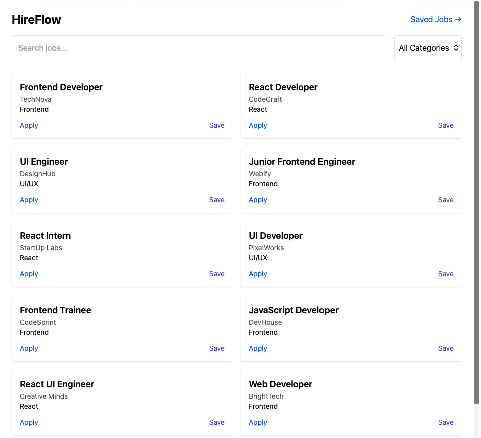
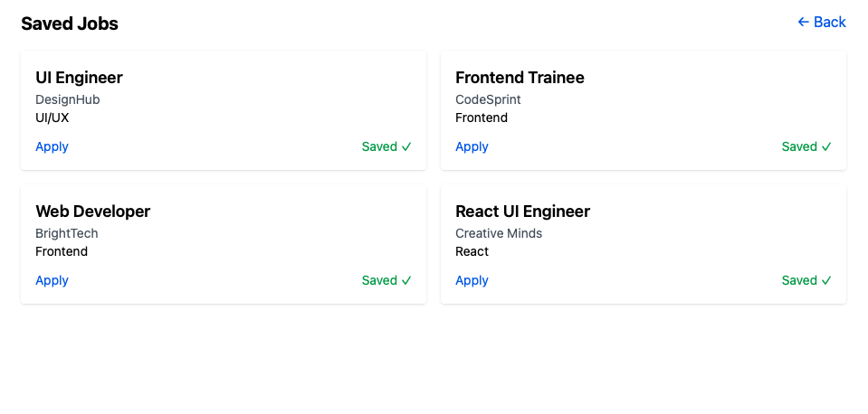
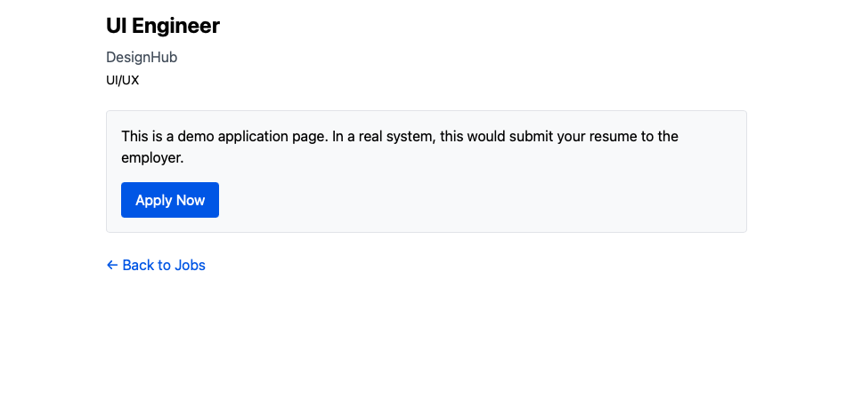
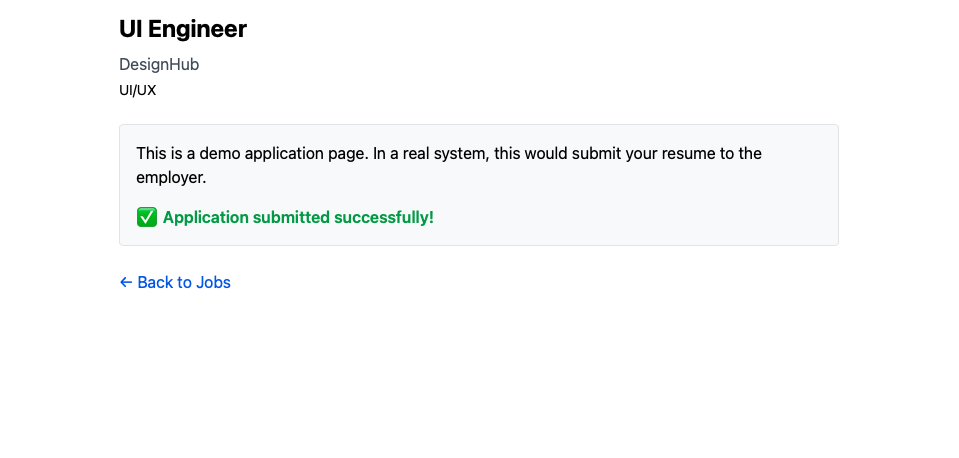

HireFlow – Job Discovery Platform

HireFlow is a React-based job discovery platform that simulates the core frontend behavior of a real-world job portal.
The project demonstrates frontend feature ownership, including UI architecture, state handling, routing, persistence, and user interaction flows.

It is designed to showcase how a junior frontend developer can own and implement production-like UI features end-to-end using modern React practices.

⸻

Live Demo

🔗 [click here](https://hire-flow-jet.vercel.app/)

⸻


## 📸 Screenshots

### 🏠 Home View


### 💾 Saved Jobs Page


### 📝 Apply Job Flow


### 📄 Application Submission



⸻

## Core Features
	•	Browse job listings from a simulated data source

	•	Filter jobs by category
	•	Save and remove jobs with persistent storage

	•	View saved jobs on a dedicated page
	•	Simulated job application flow

	•	Responsive and accessible UI

	•	Graceful handling of loading, empty, and error states

⸻

## Tech Stack
	•	React
	•	JavaScript (ES6+)
	•	Tailwind CSS
	•	React Router
	•	LocalStorage
	•	Vite

## Project Structure
```text
src/
│
├── pages/
│   ├── Home.jsx        # Job listing and filtering view
│   ├── SavedJobs.jsx  # Persisted saved jobs view
│   └── ApplyJob.jsx   # Simulated application flow
│
├── components/
│   ├── JobCard.jsx    # Reusable job display component
│   ├── FilterBar.jsx  # Category filtering logic
│   ├── Loader.jsx     # Loading state UI
│   └── ErrorBox.jsx   # Error and empty state handling
│
├── data/
│   └── jobs.js        # Mock job dataset
│
├── services/
│   └── jobApi.js      # Simulated async data fetching
│
├── utils/
│   └── storage.js    # LocalStorage abstraction
│
├── App.jsx            # Routing and layout
└── main.jsx           # Application entry point
```
## My Responsibilities

	•	Designed and implemented the complete frontend UI flow

	•	Structured components to keep UI logic isolated from data handling and improve maintainability

	•	Managed application state for filtering, saving, and navigation

	•	Implemented persistent data storage using localStorage

	•	Handled UI states such as loading, empty results, and errors


	•	Built responsive layouts using Tailwind CSS

	•	Configured routing for multi-page 
  navigation using React Router

⸻

## Data Handling Approach

Job data is served using mock data with simulated asynchronous fetching.

This approach was chosen to:
	•	Focus on frontend behavior and UI logic

	•	Simulate real API interaction patterns

	•	Avoid backend dependency while building core features

In a production environment, job data would be served from backend APIs with authentication and server-side persistence.

⸻

## Engineering Highlights

	•	Clean separation between UI components and data logic

	•	Abstracted storage logic into reusable utilities for maintainability

	•	Structured state to avoid unnecessary re-renders

	•	Routing-based page flow using React Router

	•	Defensive UI handling for edge cases such as empty job results and fetch failures

	•	Ensured synchronization between saved jobs state and localStorage to prevent UI 
  

⸻

## Limitations & Next Steps

This project intentionally focuses on frontend responsibilities only.

## Planned enhancements:

	•	Backend API integration
	•	Pagination and sorting
	•	Search by company or role
	•	Authentication and user profiles
	•	Job application form with validation

⸻

## Why This Project

HireFlow was built to demonstrate real-world frontend problem-solving, not just UI styling.

⸻

## 📌 Status

Stable frontend feature set complete. Further improvements planned.
